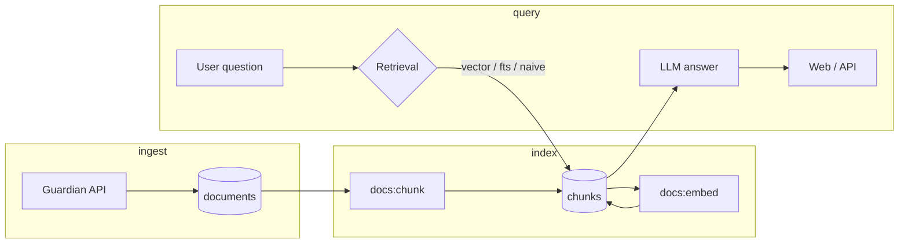

# osint-rag

A monorepo for ingesting open-source news articles, indexing them for search, and answering questions with retrieval-augmented generation (RAG). Built for OSINT-style research: answers stay grounded in retrieved sources, with citations and query logging.

The stack started from [Better-T-Stack](https://github.com/AmanVarshney01/create-better-t-stack) (React, TanStack Router, Hono, Prisma) and was extended with a document pipeline, pgvector embeddings, and a streaming RAG chat UI.

## What it does

1. **Ingest** — Pull articles from The Guardian Content API and store them as `Document` rows (title, URL, author, raw text, etc.).
2. **Chunk** — Split document text into overlapping chunks suitable for retrieval.
3. **Embed** — Generate 1536-dimensional vectors (OpenAI `text-embedding-3-small` via OpenRouter) and store them in Postgres with [pgvector](https://github.com/pgvector/pgvector).
4. **Search** — Retrieve relevant chunks by vector similarity, PostgreSQL full-text search, or naive substring match.
5. **Ask** — Stream grounded answers (Gemini via OpenRouter) that cite numbered sources from the retrieved context. Queries are logged with latency, token usage, and cost.

### Web app

| Route | Purpose |
| --- | --- |
| `/` | Document inventory (source, title, published date) |
| `/documents/:documentId` | Single-document detail |
| `/ask` | Streaming RAG chat with retrieval strategy selector (vector vs full-text) |

### API (Hono)

| Method | Path | Description |
| --- | --- | --- |
| `GET` | `/`, `/health` | Health checks |
| `GET` | `/documents` | List documents |
| `GET` | `/documents/:id` | Document detail |
| `GET` | `/search?q=...&strategy=...&limit=...` | Chunk search (`naive`, `fts`, `vector`) |
| `POST` | `/rag/query` | Non-streaming RAG answer |
| `POST` | `/rag/stream` | Streaming RAG (AI SDK UI message stream) |
| `POST` | `/rag/query/debug` | Full RAG payload including internal chunks (development only) |

Request bodies for RAG endpoints are validated by `ragQuerySchema` in `packages/schemas` (`query`, `strategy`, `limit`).

## Architecture



## Tech stack

- **Runtime** — [Bun](https://bun.sh) workspaces
- **Web** — React 19, Vite, TanStack Router, TanStack Query, Tailwind CSS, AI SDK React (`useChat`)
- **API** — Hono on Bun
- **Database** — PostgreSQL + Prisma 7 + pgvector
- **AI** — Vercel AI SDK, OpenRouter (embeddings + chat)
- **Shared** — `packages/ui` (shadcn/ui), `packages/schemas` (Zod), `packages/types`, `packages/env` (t3-env)
- **Tooling** — Biome (lint/format), TypeScript

## Prerequisites

- [Bun](https://bun.sh) 1.3.9+ (see `packageManager` in root `package.json`)
- Docker (for local Postgres via `packages/db/docker-compose.yml`)
- API keys:
  - [OpenRouter](https://openrouter.ai/) — embeddings and chat models
  - [The Guardian Open Platform](https://open-platform.theguardian.com/) — article ingest

## Getting started

### 1. Install dependencies

```bash
bun install
```

### 2. Environment

Copy the examples and fill in your keys:

```bash
cp apps/server/.env.example apps/server/.env
cp apps/web/.env.example apps/web/.env
```

`packages/env` validates these at runtime; missing or invalid values fail fast.

### 3. Database

Start Postgres and apply the schema:

```bash
bun run db:start
bun run db:push
```

Optional: open Prisma Studio with `bun run db:studio`.

### 4. Ingest and index (first-time data)

```bash
# Fetch Guardian articles into documents
bun run ingest:guardian

# Split documents into chunks
bun run docs:chunk

# Embed chunks (OpenRouter). Use docs:embed:dry to preview without writes
bun run docs:embed
```

### 5. Run dev servers

```bash
bun run dev
```

- Web: [http://localhost:3000](http://localhost:3000)
- API: [http://localhost:3001](http://localhost:3001)

Or run apps individually: `bun run dev:web`, `bun run dev:server`.

## Project structure

```
osint-rag/
├── apps/
│   ├── web/                    # React UI (routes, RAG chat, document browser)
│   │   └── src/
│   │       ├── routes/         # File-based TanStack Router routes
│   │       ├── components/     # RAG chat, documents table, shared layout
│   │       └── api/            # Typed API client
│   └── server/                 # Hono API + ingestion/indexing scripts
│       └── src/
│           ├── modules/        # documents, search, rag, health, query-log
│           ├── scripts/        # chunk, embed, guardian-ingest CLIs
│           └── lib/ai/         # OpenRouter client, embeddings
├── packages/
│   ├── db/                     # Prisma schema, migrations, Docker Compose, client
│   ├── env/                    # Shared env validation (server + web)
│   ├── schemas/                # Zod schemas (RAG, search)
│   ├── types/                  # Shared TypeScript types
│   ├── ui/                     # Shared shadcn/ui components and global CSS
│   └── config/                 # Shared tsconfig bases
├── biome.json                  # Root formatter/linter
└── package.json                # Workspace scripts
```

Prisma schema: `packages/db/prisma/schema/schema.prisma`. Generated client: `packages/db/prisma/generated/`.

## Scripts

### Development

| Script | Description |
| --- | --- |
| `bun run dev` | Start all workspace dev servers |
| `bun run dev:web` | Web only |
| `bun run dev:server` | API only |
| `bun run build` | Build all packages |
| `bun run check-types` | Typecheck all workspaces |
| `bun run check` | Biome lint/format check |
| `bun run check:fix` | Biome auto-fix |

### Database

| Script | Description |
| --- | --- |
| `bun run db:start` | Start Postgres container |
| `bun run db:stop` | Stop container |
| `bun run db:down` | Remove container and network |
| `bun run db:push` | Push schema to database |
| `bun run db:migrate` | Run Prisma migrations |
| `bun run db:generate` | Regenerate Prisma client |
| `bun run db:studio` | Prisma Studio UI |
| `bun run db:seed` | Seed database |

### Data pipeline

| Script | Description |
| --- | --- |
| `bun run ingest:guardian` | Ingest articles from The Guardian API |
| `bun run docs:chunk` | Chunk all documents |
| `bun run docs:embed` | Embed unembedded chunks |
| `bun run docs:embed:dry` | Dry-run embed job |

## Retrieval strategies

| Strategy | Behavior |
| --- | --- |
| `vector` | Semantic similarity via pgvector (default in API and Ask UI) |
| `fts` | PostgreSQL full-text search on chunk text |
| `naive` | Case-insensitive substring match |

The Ask page exposes `vector` and `fts`. The search API and RAG backend also support `naive`.

## UI customization

Shared shadcn/ui primitives live in `packages/ui`:

- Global styles: `packages/ui/src/styles/globals.css`
- Components: `packages/ui/src/components/*`
- Add primitives from the repo root:

```bash
bunx shadcn@latest add accordion dialog -c packages/ui
```

Import in apps:

```tsx
import { Button } from "@osint-rag/ui/components/button";
```

## Verification

There is no CI test suite yet. After changes:

```bash
bun run check-types
bun run check
```

If you change the Prisma schema, run `bun run db:generate` and `bun run db:push` or `bun run db:migrate` before typechecking app code.

## Production

- **`POST /rag/query/debug`** is not registered when `NODE_ENV=production`. Use it locally for retrieval debugging; production clients should use `/rag/query` or `/rag/stream`.
- **Secrets** — Set `OPENROUTER_API_KEY`, `GUARDIAN_API_KEY`, `DATABASE_URL`, and related vars in your host environment (Railway, Fly, etc.). Do not bake `apps/server/.env` into container images.
- **Database** — `packages/db/docker-compose.yml` is for local dev only (Postgres on `localhost:5432` with a fixed dev password). In production, use a managed Postgres with pgvector or a private network; do not publish port 5432 on a public VM.

